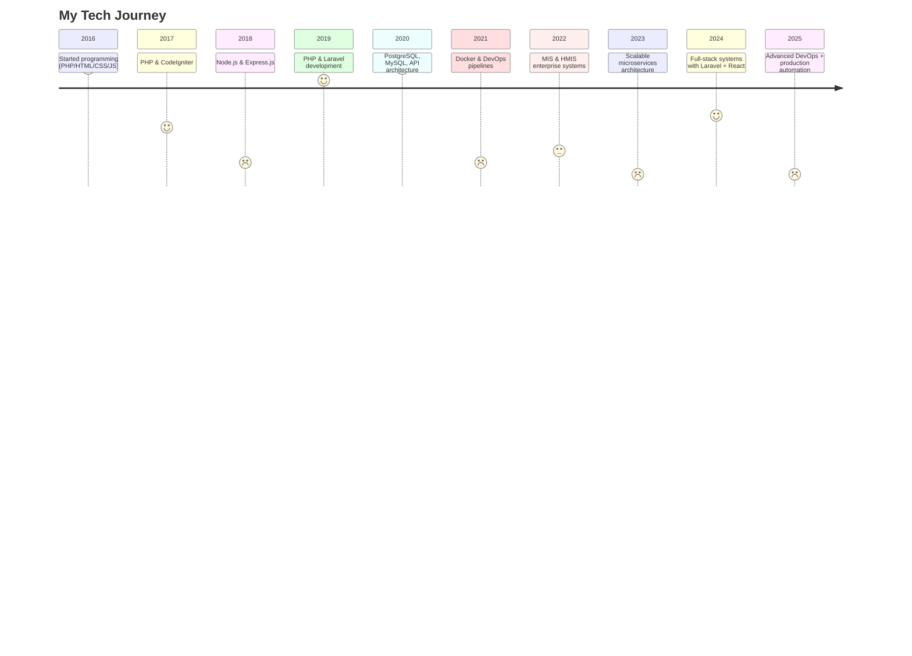

<!-- HEADER BANNER -->

  

<!-- ANIMATED INTRO -->
<h3 align="center">
  
</h3>

  
  

---

# 👨‍💻 About Me

I’m **Azizullah Aziz**, a passionate **Full-Stack Developer**, **DevOps Engineer**, and **MIS Specialist** building highly scalable, secure, production-grade systems.

🔹 Laravel, React, Docker, PostgreSQL  
🔹 Microservices, CI/CD Automation  
🔹 MIS / HMIS Enterprise Systems  
🔹 High-performance backend architecture  
🔹 Modern UX + clean engineering practices  

---

# 🚀 Tech Stack (Interactive Orbit)

  

---

# 🛰️ Tech Experience Timeline  

# 🧰 Tools I Use Daily

  

---

# 💼 Featured Portfolio

## 🚑 HMS-Pro — Hospital Management System
Enterprise-level HIS with patient visits, lab tests, billing, receipts, QR token printing, hospitalization & more.  
**Tech:** Laravel, Livewire, React, Docker, PostgreSQL

## 🧩 Microservices Migration
Breaking monolith into stable containerized microservices.  
**Tech:** Docker, REST APIs, Nginx routing

## 🤖 WhatsApp Messaging Automation
Event-driven messaging using queues + API integration.  
**Tech:** Laravel, Workers, REST

## ⚙️ DevOps CI/CD Pipeline
Zero-downtime automatic deployments using GitHub Actions.  
**Tech:** Docker, CI/CD, Testing

---

# 📄 Download My Resume

  

---

# ⭐ GitHub Stats

   
 
  

---

# 🏆 Achievements

  

---

# 🧬 Contribution Snake (3D Animation)

  

---

# 🏙 GitHub Skyline (3D)
🌆 Your interactive 3D GitHub skyline:  
👉 https://skyline.github.com/azizullahaziz

---

# 📈 GitHub Activity Graph

  

---

# 📬 Connect

   

---

# 🎭 Random Inspiring Quote

  

---

# 😂 Developer Joke of the Day

  

---

<!-- FOOTER BANNER -->

  

