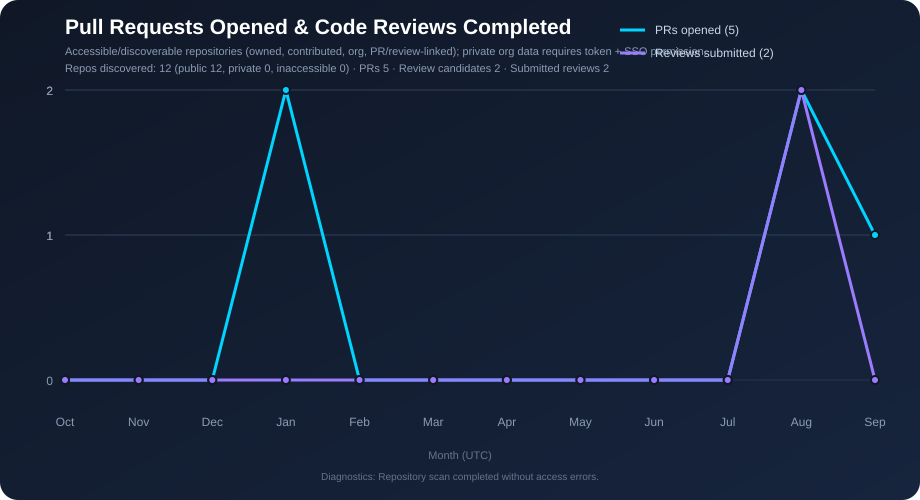
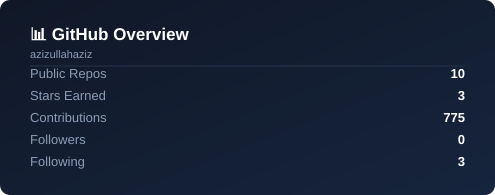
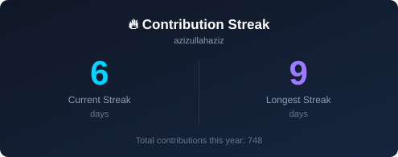
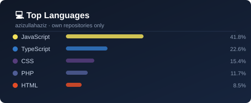

<!-- =========================
     HERO SECTION
========================= -->

<p align="center">
  
</p>

<p align="center">
  <a href="https://github.com/azizullahaziz">
    
  </a>
  <a href="https://linkedin.com/in/aziz2949">
    
  </a>
  <a href="mailto:azizullahaziz.work@gmail.com">
    
  </a>
</p>

<p align="center">
  
</p>

<p align="center">
  
</p>

---

## 👋 About Me

I’m **Azizullah Aziz**, a **Full-Stack Engineer, DevOps Engineer, and Enterprise Systems Specialist** focused on building secure, scalable, and production-ready platforms.

My experience spans **FinTech, ERP, healthcare information systems, enterprise applications, micro-frontends, mobile applications, search platforms, and DevOps automation**.

I work across the complete software lifecycle:

- System architecture and technical planning
- Backend and API development
- Frontend and mobile application development
- Database and search-engine design
- Microservices and micro-frontend architecture
- CI/CD automation and containerized deployments
- Production reliability and performance improvement

I care about **clean architecture, secure APIs, maintainable code, reliable deployments, high-performance search, and excellent user experience**.

```text
Currently focused on:

▸ FinTech and transaction-oriented platforms
▸ ERP and enterprise management systems
▸ Laravel and Java/Spring Boot services
▸ React and Angular enterprise applications
▸ Native Federation micro-frontend architecture
▸ Flutter mobile applications
▸ Typesense-powered enterprise search
▸ Docker, CI/CD, and production automation
```

---

## 🧰 Technology Stack

<p align="center">
  
</p>

### Backend & API Engineering

`PHP` · `Laravel` · `Java` · `Spring Boot` · `Node.js` · `REST APIs` · `Microservices`

### Frontend & Micro-Frontends

`React` · `Angular` · `Next.js` · `JavaScript` · `TypeScript` · `Native Federation` · `Module Federation`

### Mobile Development

`Flutter` · `Dart` · `REST API Integration` · `Cross-Platform Applications`

### Enterprise Systems

`FinTech Platforms` · `ERP Systems` · `HMIS` · `Workflow Automation` · `Transaction Processing` · `Role-Based Access Control`

### Databases & Search

`PostgreSQL` · `MySQL` · `Redis` · `Typesense` · `Database Design` · `Search Indexing`

### Infrastructure & DevOps

`Docker` · `Nginx` · `Linux` · `GitHub Actions` · `CI/CD` · `Automated Testing` · `Production Automation`

---

## 🚀 Selected Work

### 💳 FinTech & Transaction Platforms

Designed and developed secure, workflow-driven systems for financial operations, transaction processing, reporting, and business controls.

**Focus areas:**

- Transaction-oriented business workflows
- Payment and financial data processing
- Financial reporting and operational dashboards
- Audit trails and traceability
- Role-based access control
- Secure API integrations
- Data validation and business rules

**Technologies:** Laravel · Java · Spring Boot · PostgreSQL · Redis · Docker

---

### 🏢 ERP & Enterprise Management Systems

Built modular ERP solutions that connect departments, users, workflows, and operational data through unified enterprise platforms.

**Focus areas:**

- Multi-module enterprise architecture
- Finance and accounting workflows
- Inventory and procurement
- Human resources and administration
- Approval and authorization processes
- Business reporting and analytics
- Configurable roles and permissions
- Interdepartmental workflow automation

**Technologies:** Laravel · React · Angular · Java · Spring Boot · PostgreSQL · REST APIs

---

### 🚑 HMS-Pro — Hospital Management System

A modular hospital information platform for clinical, administrative, and financial operations.

**Capabilities include:**

- Patient registration and visit management
- Laboratory requests and results
- Billing, receipts, and payment workflows
- Hospitalization management
- QR-based token printing
- Role-based dashboards
- Searchable patient records
- API-driven integrations
- Operational and management reporting

**Technologies:** Laravel · React · Angular · PostgreSQL · Typesense · Docker

---

### 🧩 Native Federation Micro-Frontend Architecture

Designed a scalable frontend architecture using **Native Federation** to enable independently developed and deployed frontend applications to work together as a unified product.

**Focus areas:**

- Independently deployable frontend modules
- React and Angular micro-frontends
- Shared authentication and authorization
- Cross-application navigation
- Shared design systems and UI components
- Versioned frontend dependencies
- Domain-based team ownership
- Gradual migration from monolithic frontends

**Technologies:** React · Angular · TypeScript · Native Federation · Module Federation · REST APIs · Docker

---

### 🔎 Typesense Enterprise Search

Implemented fast and user-friendly search experiences for enterprise and operational systems using **Typesense**.

**Focus areas:**

- Typo-tolerant search
- Instant search suggestions
- Faceted filtering
- Search across large business datasets
- Patient, product, invoice, and transaction lookup
- Search indexing and synchronization
- Optimized search response times

**Technologies:** Typesense · Laravel · Java/Spring Boot · React · Angular · PostgreSQL

---

### 📱 Flutter Mobile Applications

Developed cross-platform mobile applications connected to secure backend APIs and enterprise workflows.

**Focus areas:**

- Secure authentication and sessions
- API-driven mobile workflows
- Responsive mobile interfaces
- Business forms and data collection
- Notifications and status tracking
- Cross-platform application delivery
- Integration with enterprise platforms

**Technologies:** Flutter · Dart · Laravel · Spring Boot · REST APIs

---

### ⚙️ DevOps & CI/CD Automation

Created repeatable deployment pipelines for containerized applications and distributed services.

**Focus areas:**

- Automated testing
- Docker image builds
- Environment-specific deployments
- Deployment verification
- Rollback-ready releases
- Backend and frontend orchestration
- Production configuration management
- Reduced manual deployment effort

**Technologies:** GitHub Actions · Docker · Linux · Nginx · Laravel · Spring Boot · React · Angular

---

## 📊 Pull Requests & Code Reviews

Monthly engineering collaboration over the last 12 months (UTC), across accessible/discoverable repositories.

This chart compares **pull requests opened** with **pull-request reviews completed**.

<p align="center">
  
</p>

---

## 📈 GitHub Overview

> Analytics assets are generated automatically by GitHub Actions and committed to this repository.
> Scope note: charts cover repositories discoverable with the workflow token (owned, contributed, organization-accessible, PR/review-linked). Private org repositories require token permission and organization SSO authorization.

<p align="center">
  
  
</p>

<p align="center">
  
</p>

---

## 🛠️ Daily Tools

<p align="center">
  
</p>

---

## 🔭 Engineering Principles

- Build for maintainability, not only for delivery
- Prefer simple architecture with clear boundaries
- Design systems around real operational workflows
- Automate repetitive and error-prone processes
- Treat security and observability as product features
- Use testing and continuous feedback to improve reliability
- Document technical decisions for future maintainers
- Deliver software that is measurable, scalable, and dependable

---

## 🌱 Currently Learning & Exploring

- Advanced Java and Spring Boot architecture
- Distributed systems and event-driven platforms
- FinTech security and transaction processing
- ERP domain modeling and business workflows
- Native Federation at enterprise scale
- React and Angular micro-frontend strategies
- Search relevance optimization with Typesense
- Flutter application architecture
- Cloud-native deployment strategies
- Platform engineering and infrastructure automation

---

## 📬 Let’s Connect

I’m interested in collaborating on:

- FinTech and payment platforms
- ERP and enterprise information systems
- Healthcare and HMIS platforms
- Laravel and Spring Boot applications
- React and Angular frontend systems
- Native Federation micro-frontends
- Flutter mobile applications
- DevOps and deployment automation
- Open-source engineering projects

<p align="center">
  <a href="https://linkedin.com/in/aziz2949">
    
  </a>
  <a href="mailto:aziz.h2949@gmail.com">
    
  </a>
</p>

---

<p align="center">
  <i>Designing dependable systems. Automating delivery. Solving meaningful problems.</i>
</p>

<p align="center">
  
</p>
